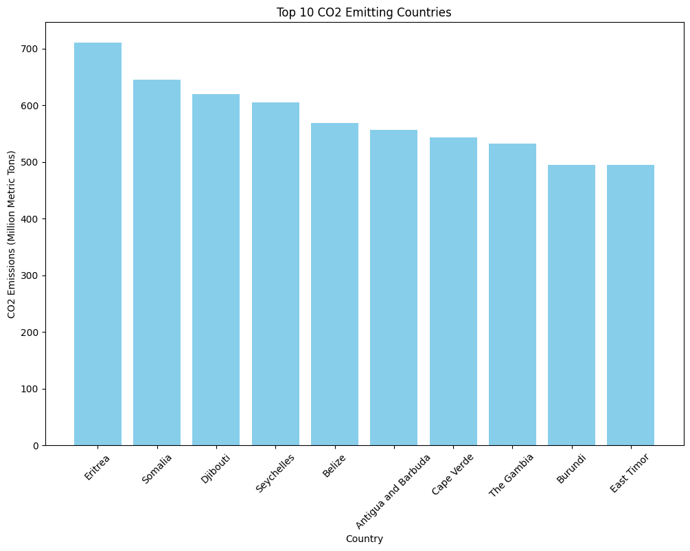
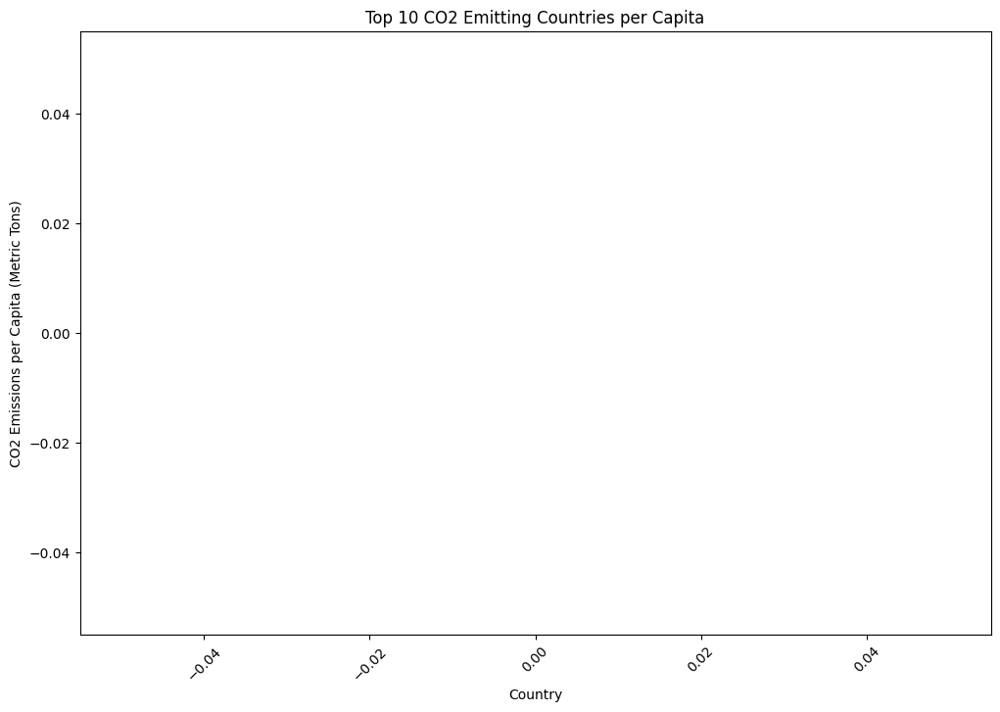
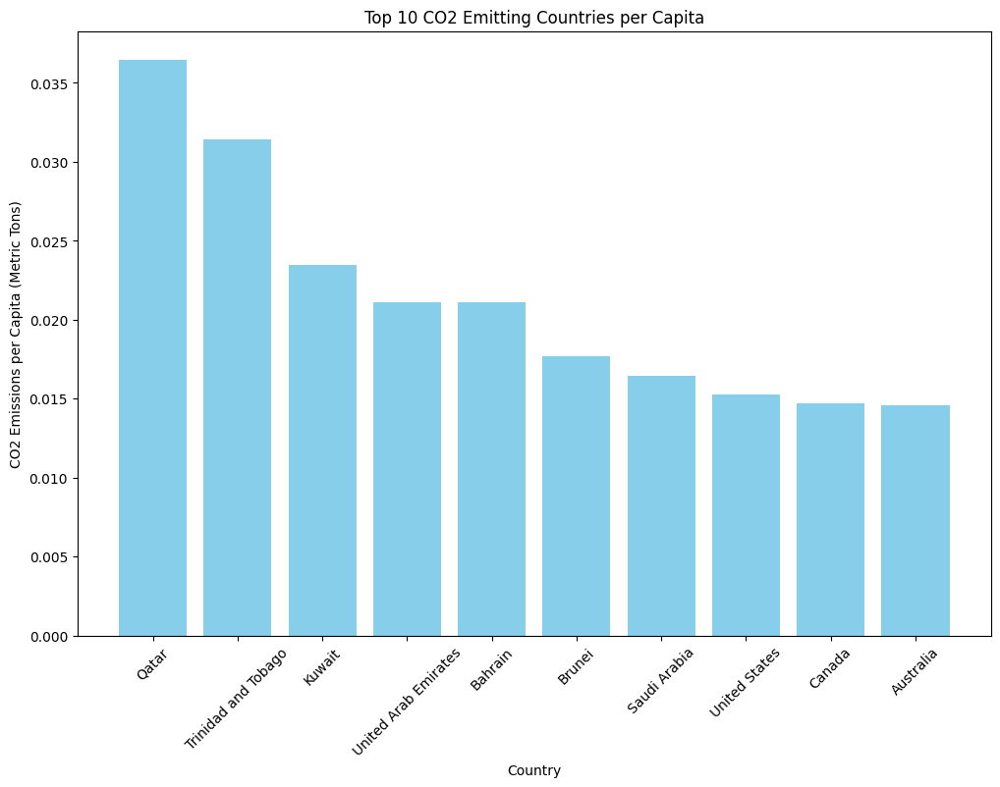

# [Data Resource](https://www.kaggle.com/datasets/nelgiriyewithana/countries-of-the-world-2023/data)

***

An analysis of CO2 emmisons based on Glaobal 2023 data. 


```python
# Import
import pandas as pd
import matplotlib.pyplot as plt
import seaborn as sns

# Load the dataset
data = pd.read_csv('data/world-data-2023.csv')


```


```python
# Display The column names and data types
print(data.dtypes)
```

    Country                                       object
    Density\n(P/Km2)                              object
    Abbreviation                                  object
    Agricultural Land( %)                         object
    Land Area(Km2)                                object
    Armed Forces size                             object
    Birth Rate                                   float64
    Calling Code                                 float64
    Capital/Major City                            object
    Co2-Emissions                                 object
    CPI                                           object
    CPI Change (%)                                object
    Currency-Code                                 object
    Fertility Rate                               float64
    Forested Area (%)                             object
    Gasoline Price                                object
    GDP                                           object
    Gross primary education enrollment (%)        object
    Gross tertiary education enrollment (%)       object
    Infant mortality                             float64
    Largest city                                  object
    Life expectancy                              float64
    Maternal mortality ratio                     float64
    Minimum wage                                  object
    Official language                             object
    Out of pocket health expenditure              object
    Physicians per thousand                      float64
    Population                                    object
    Population: Labor force participation (%)     object
    Tax revenue (%)                               object
    Total tax rate                                object
    Unemployment rate                             object
    Urban_population                              object
    Latitude                                     float64
    Longitude                                    float64
    dtype: object
    


```python
# Convert 'Co2-Emissions' to numeric
data['Co2-Emissions'] = pd.to_numeric(data['Co2-Emissions'], errors='coerce')

# Drop rows with missing values in 'Co2-Emissions'
data = data.dropna(subset=['Co2-Emissions'])

# Sort the data by 'Co2-Emissions' in descending order and select the top 10
top_polluters = data.sort_values(by='Co2-Emissions', ascending=False).head(10)

# Plot a bar chart
plt.figure(figsize=(12, 8))
plt.bar(top_polluters['Country'], top_polluters['Co2-Emissions'], color='skyblue')
plt.xlabel('Country')
plt.ylabel('CO2 Emissions (Million Metric Tons)')
plt.title('Top 10 CO2 Emitting Countries')
plt.xticks(rotation=45)
plt.show()

```


    

    


```python

# Convert 'Co2-Emissions' and 'Population' to numeric
data['Co2-Emissions'] = pd.to_numeric(data['Co2-Emissions'], errors='coerce')
data['Population'] = pd.to_numeric(data['Population'], errors='coerce')

# Check for missing values after conversion
print(data[['Co2-Emissions', 'Population']].isnull().sum())

# Drop rows with missing values in 'Co2-Emissions' or 'Population'
data = data.dropna(subset=['Co2-Emissions', 'Population'])

# Calculate CO2 emissions per capita
data['CO2_per_Capita'] = data['Co2-Emissions'] / data['Population']

# Check the top 10 countries by CO2 emissions per capita
top_polluters_per_capita = data.sort_values(by='CO2_per_Capita', ascending=False).head(10)
print(top_polluters_per_capita[['Country', 'CO2_per_Capita']])

# Plot a bar chart
plt.figure(figsize=(12, 8))
plt.bar(top_polluters_per_capita['Country'], top_polluters_per_capita['CO2_per_Capita'], color='skyblue')
plt.xlabel('Country')
plt.ylabel('CO2 Emissions per Capita (Metric Tons)')
plt.title('Top 10 CO2 Emitting Countries per Capita')
plt.xticks(rotation=45)
plt.show()

```

    Co2-Emissions    0
    Population       0
    dtype: int64
    Empty DataFrame
    Columns: [Country, CO2_per_Capita]
    Index: []
    


    

    


```python
# Check unique values in 'Co2-Emissions' and 'Population' before conversion
print("Unique values in 'Co2-Emissions':", data['Co2-Emissions'].unique())
print("Unique values in 'Population':", data['Population'].unique())

# Convert 'Co2-Emissions' and 'Population' to numeric
data['Co2-Emissions'] = pd.to_numeric(data['Co2-Emissions'], errors='coerce')
data['Population'] = pd.to_numeric(data['Population'], errors='coerce')

# Check for missing values after conversion
print(data[['Co2-Emissions', 'Population']].isnull().sum())

# Drop rows with missing values in 'Co2-Emissions' or 'Population'
data = data.dropna(subset=['Co2-Emissions', 'Population'])

# Calculate CO2 emissions per capita
data['CO2_per_Capita'] = data['Co2-Emissions'] / data['Population']

# Check the top 10 countries by CO2 emissions per capita
top_polluters_per_capita = data.sort_values(by='CO2_per_Capita', ascending=False).head(10)
print(top_polluters_per_capita[['Country', 'CO2_per_Capita']])

```

    Unique values in 'Co2-Emissions': []
    Unique values in 'Population': []
    Co2-Emissions    0
    Population       0
    dtype: int64
    Empty DataFrame
    Columns: [Country, CO2_per_Capita]
    Index: []
    


```python
import pandas as pd

# Load the dataset
file_path = 'data/world-data-2023.csv'  # Update this with the correct file path
data = pd.read_csv(file_path)

# Display the first few rows of the dataset
print(data.head())

# Display the data types of all columns
print(data.dtypes)

```

           Country Density\n(P/Km2) Abbreviation Agricultural Land( %)  \
    0  Afghanistan               60           AF                58.10%   
    1      Albania              105           AL                43.10%   
    2      Algeria               18           DZ                17.40%   
    3      Andorra              164           AD                40.00%   
    4       Angola               26           AO                47.50%   
    
      Land Area(Km2) Armed Forces size  Birth Rate  Calling Code  \
    0        652,230           323,000       32.49          93.0   
    1         28,748             9,000       11.78         355.0   
    2      2,381,741           317,000       24.28         213.0   
    3            468               NaN        7.20         376.0   
    4      1,246,700           117,000       40.73         244.0   
    
      Capital/Major City Co2-Emissions  ... Out of pocket health expenditure  \
    0              Kabul         8,672  ...                           78.40%   
    1             Tirana         4,536  ...                           56.90%   
    2            Algiers       150,006  ...                           28.10%   
    3   Andorra la Vella           469  ...                           36.40%   
    4             Luanda        34,693  ...                           33.40%   
    
      Physicians per thousand  Population  \
    0                    0.28  38,041,754   
    1                    1.20   2,854,191   
    2                    1.72  43,053,054   
    3                    3.33      77,142   
    4                    0.21  31,825,295   
    
       Population: Labor force participation (%) Tax revenue (%) Total tax rate  \
    0                                     48.90%           9.30%         71.40%   
    1                                     55.70%          18.60%         36.60%   
    2                                     41.20%          37.20%         66.10%   
    3                                        NaN             NaN            NaN   
    4                                     77.50%           9.20%         49.10%   
    
      Unemployment rate Urban_population   Latitude  Longitude  
    0            11.12%        9,797,273  33.939110  67.709953  
    1            12.33%        1,747,593  41.153332  20.168331  
    2            11.70%       31,510,100  28.033886   1.659626  
    3               NaN           67,873  42.506285   1.521801  
    4             6.89%       21,061,025 -11.202692  17.873887  
    
    [5 rows x 35 columns]
    Country                                       object
    Density\n(P/Km2)                              object
    Abbreviation                                  object
    Agricultural Land( %)                         object
    Land Area(Km2)                                object
    Armed Forces size                             object
    Birth Rate                                   float64
    Calling Code                                 float64
    Capital/Major City                            object
    Co2-Emissions                                 object
    CPI                                           object
    CPI Change (%)                                object
    Currency-Code                                 object
    Fertility Rate                               float64
    Forested Area (%)                             object
    Gasoline Price                                object
    GDP                                           object
    Gross primary education enrollment (%)        object
    Gross tertiary education enrollment (%)       object
    Infant mortality                             float64
    Largest city                                  object
    Life expectancy                              float64
    Maternal mortality ratio                     float64
    Minimum wage                                  object
    Official language                             object
    Out of pocket health expenditure              object
    Physicians per thousand                      float64
    Population                                    object
    Population: Labor force participation (%)     object
    Tax revenue (%)                               object
    Total tax rate                                object
    Unemployment rate                             object
    Urban_population                              object
    Latitude                                     float64
    Longitude                                    float64
    dtype: object
    


```python

# Remove commas and convert 'Co2-Emissions' and 'Population' to numeric
data['Co2-Emissions'] = pd.to_numeric(data['Co2-Emissions'].str.replace(',', ''), errors='coerce')
data['Population'] = pd.to_numeric(data['Population'].str.replace(',', ''), errors='coerce')

# Drop rows with missing values in 'Co2-Emissions' or 'Population'
data = data.dropna(subset=['Co2-Emissions', 'Population'])

# Calculate CO2 emissions per capita
data['CO2_per_Capita'] = data['Co2-Emissions'] / data['Population']

# Sort the data by 'CO2_per_Capita' in descending order and select the top 10
top_polluters_per_capita = data.sort_values(by='CO2_per_Capita', ascending=False).head(10)

# Plot a bar chart
plt.figure(figsize=(12, 8))
plt.bar(top_polluters_per_capita['Country'], top_polluters_per_capita['CO2_per_Capita'], color='skyblue')
plt.xlabel('Country')
plt.ylabel('CO2 Emissions per Capita (Metric Tons)')
plt.title('Top 10 CO2 Emitting Countries per Capita')
plt.xticks(rotation=45)
plt.show()

```


    

    

