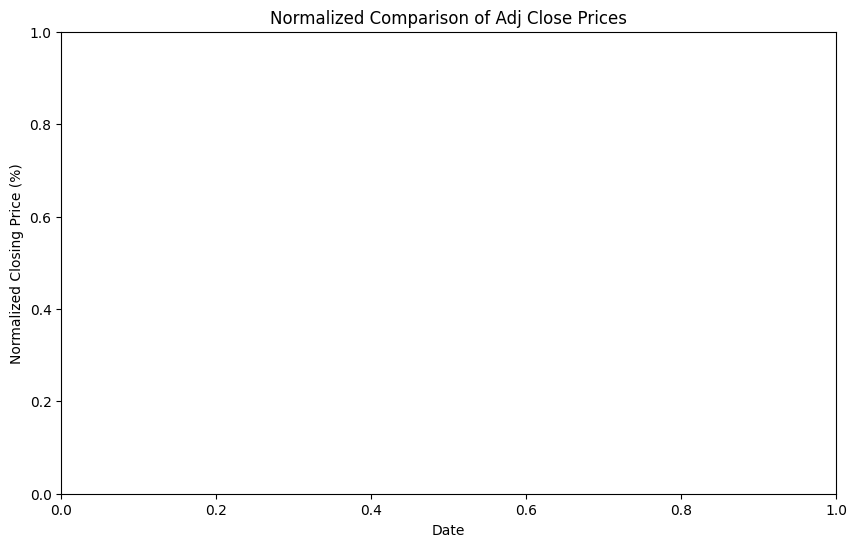

```python
# Import
# In case of a an 'No module named' error, install dash, pandas etc
# pip install dash
import dash
import seaborn as sns
import matplotlib.pyplot as plt
from dash import dcc, html
import plotly.express as px
import plotly.graph_objs as go
import pandas as pd
import yfinance as yf
```


```python
# Fetch data
#S&P 500 - ^GSPC
#S&P 500 Vanguard - VOO
#S&P 500 Black Rock - BSPIX
#Vanguard Russel Index ETF - VTWO
#FTSE 100 - ^FTSE
#FTSE 200 - ^FTMC
# You can define the various tickers - ticker_symbol = '^GSPC'
tickers = ['^GSPC', 'VOO', 'BSPIX', 'VTWO', '^FTSE', '^FTMC']
df = yf.download(tickers,  start='2020-01-01', end='2024-10-11')
#data1 = yf.download('AAPL', start='2020-01-01', end='2023-01-01')

```

    [*********************100%***********************]  6 of 6 completed
    


```python
# Convert Closing Data to a Common Scale
# The base value will be set at the start date of the data set. 
# For each date, divide the closing price by the base value and multiply by 100.
# This converts the data into a percentage of the base value. 

# Create Columns for Each of the New Values
#print(data.columns)
# Display the first few rows of the data
#print(data.head())
print(df.columns)
```

    MultiIndex([('Adj Close', 'BSPIX'),
                ('Adj Close',   'VOO'),
                ('Adj Close',  'VTWO'),
                ('Adj Close', '^FTMC'),
                ('Adj Close', '^FTSE'),
                ('Adj Close', '^GSPC'),
                (    'Close', 'BSPIX'),
                (    'Close',   'VOO'),
                (    'Close',  'VTWO'),
                (    'Close', '^FTMC'),
                (    'Close', '^FTSE'),
                (    'Close', '^GSPC'),
                (     'High', 'BSPIX'),
                (     'High',   'VOO'),
                (     'High',  'VTWO'),
                (     'High', '^FTMC'),
                (     'High', '^FTSE'),
                (     'High', '^GSPC'),
                (      'Low', 'BSPIX'),
                (      'Low',   'VOO'),
                (      'Low',  'VTWO'),
                (      'Low', '^FTMC'),
                (      'Low', '^FTSE'),
                (      'Low', '^GSPC'),
                (     'Open', 'BSPIX'),
                (     'Open',   'VOO'),
                (     'Open',  'VTWO'),
                (     'Open', '^FTMC'),
                (     'Open', '^FTSE'),
                (     'Open', '^GSPC'),
                (   'Volume', 'BSPIX'),
                (   'Volume',   'VOO'),
                (   'Volume',  'VTWO'),
                (   'Volume', '^FTMC'),
                (   'Volume', '^FTSE'),
                (   'Volume', '^GSPC')],
               names=['Price', 'Ticker'])
    


```python
# Add Normalised Columns

# Normalize 'Adj Close' columns 
for ticker in ['BSPIX', 'VOO', 'VTWO', '^FTMC', '^FTSE', '^GSPC']:
    base_value = df[('Adj Close', ticker)].iloc[0]
    normalized_column = (df[('Adj Close', ticker)] / base_value) * 100
    df[('Normalized', ticker)] = normalized_column
```


```python
print(df.columns)
```

    MultiIndex([( 'Adj Close', 'BSPIX'),
                ( 'Adj Close',   'VOO'),
                ( 'Adj Close',  'VTWO'),
                ( 'Adj Close', '^FTMC'),
                ( 'Adj Close', '^FTSE'),
                ( 'Adj Close', '^GSPC'),
                (     'Close', 'BSPIX'),
                (     'Close',   'VOO'),
                (     'Close',  'VTWO'),
                (     'Close', '^FTMC'),
                (     'Close', '^FTSE'),
                (     'Close', '^GSPC'),
                (      'High', 'BSPIX'),
                (      'High',   'VOO'),
                (      'High',  'VTWO'),
                (      'High', '^FTMC'),
                (      'High', '^FTSE'),
                (      'High', '^GSPC'),
                (       'Low', 'BSPIX'),
                (       'Low',   'VOO'),
                (       'Low',  'VTWO'),
                (       'Low', '^FTMC'),
                (       'Low', '^FTSE'),
                (       'Low', '^GSPC'),
                (      'Open', 'BSPIX'),
                (      'Open',   'VOO'),
                (      'Open',  'VTWO'),
                (      'Open', '^FTMC'),
                (      'Open', '^FTSE'),
                (      'Open', '^GSPC'),
                (    'Volume', 'BSPIX'),
                (    'Volume',   'VOO'),
                (    'Volume',  'VTWO'),
                (    'Volume', '^FTMC'),
                (    'Volume', '^FTSE'),
                (    'Volume', '^GSPC'),
                ('Normalized', 'BSPIX'),
                ('Normalized',   'VOO'),
                ('Normalized',  'VTWO'),
                ('Normalized', '^FTMC'),
                ('Normalized', '^FTSE'),
                ('Normalized', '^GSPC')],
               names=['Price', 'Ticker'])
    


```python
# Initialize the Dash app
app = dash.Dash(__name__)


# Create a figure
fig = go.Figure()

# Add a trace for each ticker
for ticker in tickers:
    fig.add_trace(go.Scatter(x=df.index, y=df['Normalized', ticker], mode='lines', name=ticker))
    
# Update layout to include title and axis labels 
fig.update_layout( title='Normalized Comparison of Adj Close Prices', xaxis_title='Date', yaxis_title='Normalized Closing Price (%)' )

# Define the layout of the app
app.layout = html.Div(children=[
    html.H1(children='Stock Market Analysis Dashboard'),
    dcc.Graph(
        id='example-graph',
        figure=fig
    )
])

# Run the app
if __name__ == '__main__':
    app.run_server(debug=True)
```


<iframe
    width="100%"
    height="650"
    src="http://127.0.0.1:8050/"
    frameborder="0"
    allowfullscreen

></iframe>


```python
import dash
import seaborn as sns
import matplotlib.pyplot as plt
from dash import dcc, html
import pandas as pd
import yfinance as yf

# Initialize the Dash app
app = dash.Dash(__name__)

# Download data using yfinance
tickers = ['^GSPC', 'VOO', 'BSPIX', 'VTWO', '^FTSE', '^FTMC']
df = yf.download(tickers, start='2020-01-01', end='2024-10-11')

# Normalize 'Adj Close' columns
for ticker in tickers:
    base_value = df[('Adj Close', ticker)].iloc[0]
    normalized_column = (df[('Adj Close', ticker)] / base_value) * 100
    df[('Normalized', ticker)] = normalized_column

# ... (Your code for data download and normalization)

# Completely flatten the DataFrame
df_flattened = df.stack().reset_index()

# Select the desired columns
df_flattened = df_flattened[['Date', 'Ticker', 'Adj Close']]

# Filter for normalized data
df_normalized = df_flattened[df_flattened['Ticker'].str.startswith('Normalized')]

# ... (Rest of your code)

# Create Seaborn plot
plt.figure(figsize=(10, 6))
sns.lineplot(data=df_normalized, x='Date', y='Adj Close', hue='Ticker')

# Set axis labels and title
plt.xlabel('Date')
plt.ylabel('Normalized Closing Price (%)')
plt.title('Normalized Comparison of Adj Close Prices')

# Save the plot as an image
plt.savefig('assets/normalized_comparison.png')
plt.show()

# Define the layout of the Dash app
app.layout = html.Div(children=[
    html.H1(children='Stock Market Analysis Dashboard'),
    html.Img(src='/assets/normalized_comparison.png')  # Ensure this path is correct
])

# Run the app
if __name__ == '__main__':
    app.run_server(debug=True)
```

    [*********************100%***********************]  6 of 6 completed
    C:\Users\pthuk\AppData\Local\Temp\ipykernel_38620\2762590416.py:24: FutureWarning:
    
    The previous implementation of stack is deprecated and will be removed in a future version of pandas. See the What's New notes for pandas 2.1.0 for details. Specify future_stack=True to adopt the new implementation and silence this warning.
    
    


    ---------------------------------------------------------------------------

    FileNotFoundError                         Traceback (most recent call last)

    Cell In[63], line 44
         41 plt.title('Normalized Comparison of Adj Close Prices')
         43 # Save the plot as an image
    ---> 44 plt.savefig('assets/normalized_comparison.png')
         45 plt.show()
         47 # Define the layout of the Dash app
    

    File c:\Python312\Lib\site-packages\matplotlib\pyplot.py:1228, in savefig(*args, **kwargs)
       1225 fig = gcf()
       1226 # savefig default implementation has no return, so mypy is unhappy
       1227 # presumably this is here because subclasses can return?
    -> 1228 res = fig.savefig(*args, **kwargs)  # type: ignore[func-returns-value]
       1229 fig.canvas.draw_idle()  # Need this if 'transparent=True', to reset colors.
       1230 return res
    

    File c:\Python312\Lib\site-packages\matplotlib\figure.py:3395, in Figure.savefig(self, fname, transparent, **kwargs)
       3393     for ax in self.axes:
       3394         _recursively_make_axes_transparent(stack, ax)
    -> 3395 self.canvas.print_figure(fname, **kwargs)
    

    File c:\Python312\Lib\site-packages\matplotlib\backend_bases.py:2204, in FigureCanvasBase.print_figure(self, filename, dpi, facecolor, edgecolor, orientation, format, bbox_inches, pad_inches, bbox_extra_artists, backend, **kwargs)
       2200 try:
       2201     # _get_renderer may change the figure dpi (as vector formats
       2202     # force the figure dpi to 72), so we need to set it again here.
       2203     with cbook._setattr_cm(self.figure, dpi=dpi):
    -> 2204         result = print_method(
       2205             filename,
       2206             facecolor=facecolor,
       2207             edgecolor=edgecolor,
       2208             orientation=orientation,
       2209             bbox_inches_restore=_bbox_inches_restore,
       2210             **kwargs)
       2211 finally:
       2212     if bbox_inches and restore_bbox:
    

    File c:\Python312\Lib\site-packages\matplotlib\backend_bases.py:2054, in FigureCanvasBase._switch_canvas_and_return_print_method.<locals>.<lambda>(*args, **kwargs)
       2050     optional_kws = {  # Passed by print_figure for other renderers.
       2051         "dpi", "facecolor", "edgecolor", "orientation",
       2052         "bbox_inches_restore"}
       2053     skip = optional_kws - {*inspect.signature(meth).parameters}
    -> 2054     print_method = functools.wraps(meth)(lambda *args, **kwargs: meth(
       2055         *args, **{k: v for k, v in kwargs.items() if k not in skip}))
       2056 else:  # Let third-parties do as they see fit.
       2057     print_method = meth
    

    File c:\Python312\Lib\site-packages\matplotlib\backends\backend_agg.py:496, in FigureCanvasAgg.print_png(self, filename_or_obj, metadata, pil_kwargs)
        449 def print_png(self, filename_or_obj, *, metadata=None, pil_kwargs=None):
        450     """
        451     Write the figure to a PNG file.
        452 
       (...)
        494         *metadata*, including the default 'Software' key.
        495     """
    --> 496     self._print_pil(filename_or_obj, "png", pil_kwargs, metadata)
    

    File c:\Python312\Lib\site-packages\matplotlib\backends\backend_agg.py:445, in FigureCanvasAgg._print_pil(self, filename_or_obj, fmt, pil_kwargs, metadata)
        440 """
        441 Draw the canvas, then save it using `.image.imsave` (to which
        442 *pil_kwargs* and *metadata* are forwarded).
        443 """
        444 FigureCanvasAgg.draw(self)
    --> 445 mpl.image.imsave(
        446     filename_or_obj, self.buffer_rgba(), format=fmt, origin="upper",
        447     dpi=self.figure.dpi, metadata=metadata, pil_kwargs=pil_kwargs)
    

    File c:\Python312\Lib\site-packages\matplotlib\image.py:1676, in imsave(fname, arr, vmin, vmax, cmap, format, origin, dpi, metadata, pil_kwargs)
       1674 pil_kwargs.setdefault("format", format)
       1675 pil_kwargs.setdefault("dpi", (dpi, dpi))
    -> 1676 image.save(fname, **pil_kwargs)
    

    File c:\Python312\Lib\site-packages\PIL\Image.py:2563, in Image.save(self, fp, format, **params)
       2561         fp = builtins.open(filename, "r+b")
       2562     else:
    -> 2563         fp = builtins.open(filename, "w+b")
       2564 else:
       2565     fp = cast(IO[bytes], fp)
    

    FileNotFoundError: [Errno 2] No such file or directory: 'C:\\Users\\pthuk\\Documents\\git\\notes\\content\\python\\assets\\normalized_comparison.png'


    

    


```python
print(df_reset.columns)

```

    MultiIndex([(      'Date',      ''),
                ( 'Adj Close', 'BSPIX'),
                ( 'Adj Close',   'VOO'),
                ( 'Adj Close',  'VTWO'),
                ( 'Adj Close', '^FTMC'),
                ( 'Adj Close', '^FTSE'),
                ( 'Adj Close', '^GSPC'),
                (     'Close', 'BSPIX'),
                (     'Close',   'VOO'),
                (     'Close',  'VTWO'),
                (     'Close', '^FTMC'),
                (     'Close', '^FTSE'),
                (     'Close', '^GSPC'),
                (      'High', 'BSPIX'),
                (      'High',   'VOO'),
                (      'High',  'VTWO'),
                (      'High', '^FTMC'),
                (      'High', '^FTSE'),
                (      'High', '^GSPC'),
                (       'Low', 'BSPIX'),
                (       'Low',   'VOO'),
                (       'Low',  'VTWO'),
                (       'Low', '^FTMC'),
                (       'Low', '^FTSE'),
                (       'Low', '^GSPC'),
                (      'Open', 'BSPIX'),
                (      'Open',   'VOO'),
                (      'Open',  'VTWO'),
                (      'Open', '^FTMC'),
                (      'Open', '^FTSE'),
                (      'Open', '^GSPC'),
                (    'Volume', 'BSPIX'),
                (    'Volume',   'VOO'),
                (    'Volume',  'VTWO'),
                (    'Volume', '^FTMC'),
                (    'Volume', '^FTSE'),
                (    'Volume', '^GSPC'),
                ('Normalized', '^GSPC'),
                ('Normalized',   'VOO'),
                ('Normalized', 'BSPIX'),
                ('Normalized',  'VTWO'),
                ('Normalized', '^FTSE'),
                ('Normalized', '^FTMC')],
               names=['Price', 'Ticker'])
    
